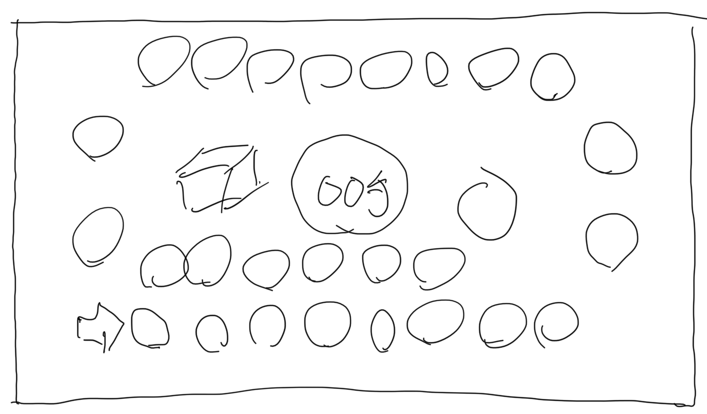

# 迷宮スゴロク 「ラビすご」
Labyrinth Sugoroku

## 企画概要
- 2年生向けのオブジェクト指向と設計、テスト、ネットワークの学習用プロジェクト
- コマやマス目をオブジェクトで設計。コマに拡張性を持たせ、コースを変化させる
- マスの各種動作を単体テスト
- プレイヤーの動きをサイコロの目をテストで疑似的に出してテスト
- 多人数プレイができるようにプレイヤーやターンを導入
- NPCの実装
- ネット対戦のためのデータベース、通信プロトコルの設計、実装

## 面白さの狙い
- マス目の並び方を変化させることでギャンブル性を高める

### フィーチャー
- コマの並び順が全てランダムに入れ替わるフルシャッフル
- 規定のコマを吹き飛ばして、そこにいるプレイヤーを振り出しに戻す大砲
- エリアをごっそり入れ替える
- あるエリアのコマの順番を逆にする

## 実装環境
- プロジェクト名 LabySugo2020LTS
- Unity2020LTS
- WebGL

## 対象ユーザー
- GitHubの基本操作を理解している
- Unityの基本操作を理解している
- C#で変数、計算、分岐、繰り返しなどを理解している

## 実装フェーズ
- フェーズ１：一人用すごろくで基本設計と線形リストとテスト。マス目を消したり増やす前提で検討
- フェーズ２：ポリモーフィズムでマスに進行ルールを入れる
- フェーズ３：コース変化要素を実装
- 応用１：多人数プレイに拡張
- 応用２：NPCの実装
- 応用３：ネット対戦。データベースの設計とサーバサイドプログラミング
- 発展１：バトル要素追加。プレイヤーとマスに戦闘用のパラメーターを設定。戦闘の実装。管理しやすいデータ設計と実装
- 発展２：収穫物の実装でゲーム性向上。経験値、レベルアップ、アイテム入手

## 素材調査
- [https://assetstore.unity.com/packages/3d/props/free-little-games-asset-pack-125089](https://assetstore.unity.com/packages/3d/props/free-little-games-asset-pack-125089)
- [https://assetstore.unity.com/packages/templates/packs/dice-pack-light-165](https://assetstore.unity.com/packages/templates/packs/dice-pack-light-165)
- [https://kenney.nl/assets/boardgame-pack](https://kenney.nl/assets/boardgame-pack)

## 参考URL
- https://sugorokuya.jp/gamelist?s=%E3%83%A9%E3%83%93%E3%83%AA%E3%83%B3%E3%82%B9

## License
MIT Licenseの予定
